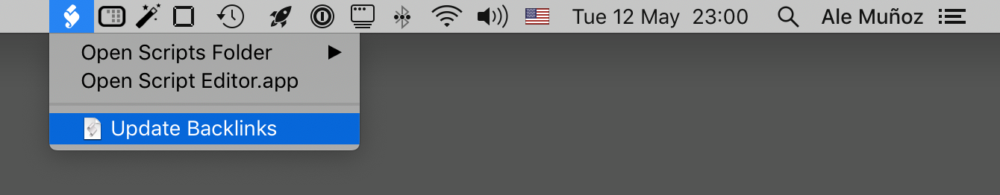

# NotePlan Backlinks

This script automates the creation of backlinks between NotePlan notes and calendar entries.

Disclaimer: I take absolutely no responsibility for any data loss. I assume you have backups, and know that running random code from the internet against your valuable data is generally considered a bad idea. Having said that, I use this with my own data and it _seems_ to work 🤞

## Usage

- Download the `backlinks.rb` file somewhere to your disk
- Open a Terminal, and run `ruby backlinks.rb`

Alternatively, you can save this code as `~/Library/Scripts/Applications/NotePlan 2/Update Backlinks.scpt` (adjusting the path to your `ruby` binary and to your `backlinks.rb` file):

```applescript
tell application "NotePlan"
  do shell script "LC_CTYPE='en_US.UTF-8' ruby /path/to/backlinks.rb"
end tell
```

Then, enable the Scripts Menu in Script Editor › Preferences › General. You’ll now have something like this on your main menu, and updating the backlinks will only take you two clicks:



## Customization

### Formatting

By default, backlinks will be added at the end of your notes, with this format:

```
♻︎ Backlinks
- [[Link One]]
- [[Link Two]]
- [[Link Three]]
♻︎ Backlinks
```

To change it, edit the `BACKLINKS_MARKER` constant in the first line of `backlinks.rb`

The script assumes your Notes are synced using iCloud. If you're using Dropbox, you'll want to adjust the path in `PATH_TO_NOTEPLAN`.

### Exclude Pages

If you want to stop backlinks from appearing on some pages, you can add them to the list of excluded pages. To do that, open `backlinks.rb` and add the page name to the `EXCLUDE_PAGES` array at the top.


## Changelog

- [x] 2020-05-25: Added support for exclude pages: a list of pages you don't want to add Backlinks to
- [x] 2020-05-24: The script now displays the line where a link appears on the source page, so you have some context for your backlinks
- [x] 2020-05-15: Added support for Calendar notes

## Roadmap

- [ ] Option to remove backlinks from all notes
- [ ] Read Backlinks template from a NotePlan note (this was something VoodooPad did, and I think it's brilliant)
- [ ] Update script remotely? This may not be worth the trouble of implementing, but on the other hand it would be nice to know if you're running an outdated version…
